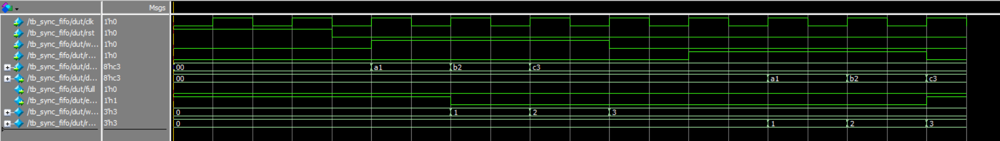

# Synchronous FIFO in SystemVerilog

## Overview
This project implements a parameterized synchronous FIFO using SystemVerilog.

## Features
- Configurable WIDTH and DEPTH
- Circular buffer architecture
- Read and write pointer management
- Full and empty flag generation
- FIFO verification using QuestaSim

## Project Structure

```text
rtl/        → FIFO RTL design
tb/         → Testbench
waveform   → Simulation waveform
```

## Simulation

Tool Used:
- QuestaSim

## Waveform


